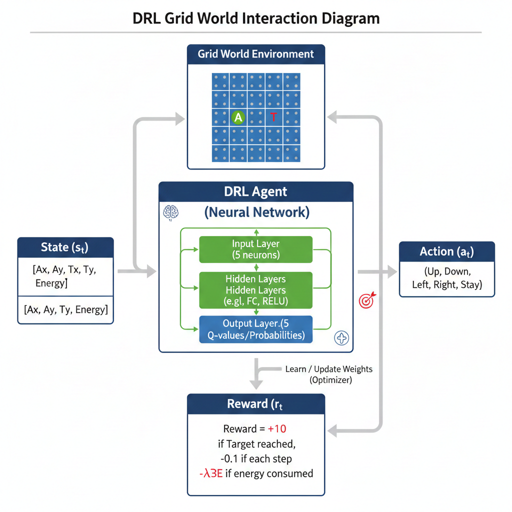
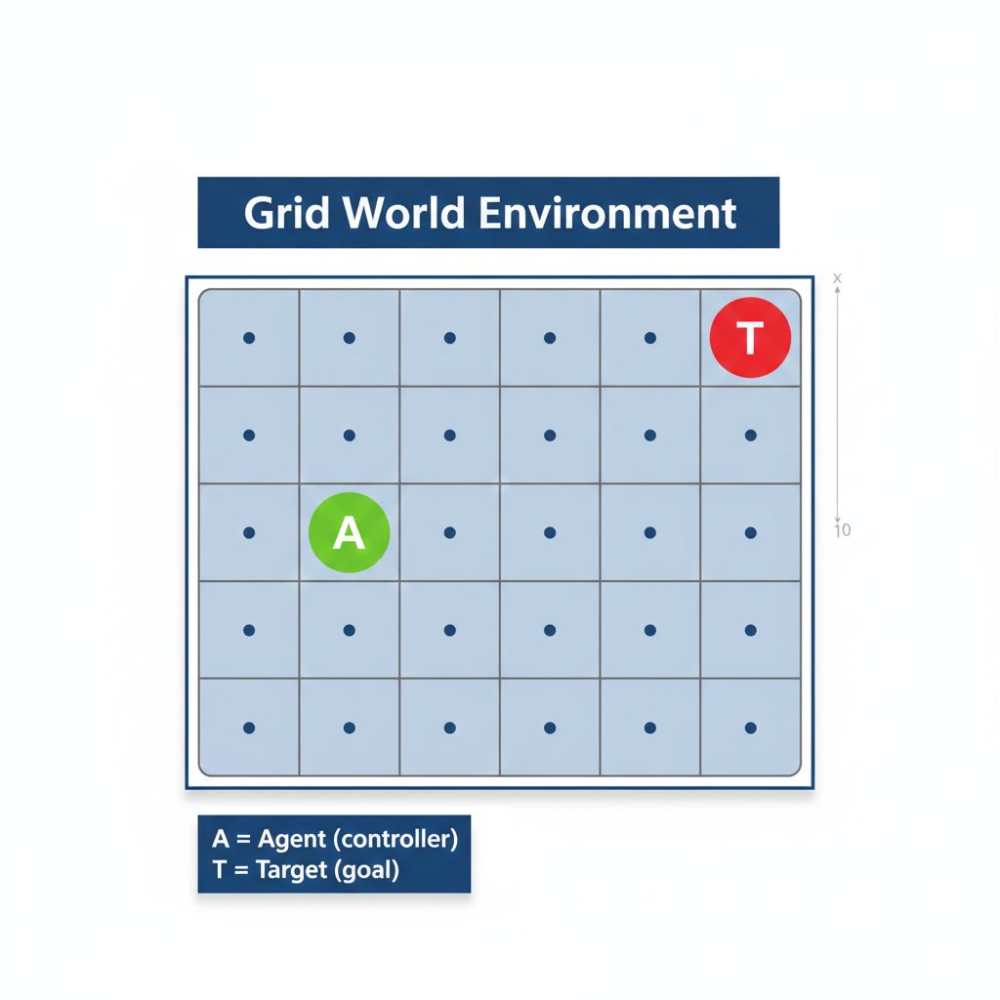

# Energy-Aware Chaser Game
### A Simple DRL Environment for Energy-Constrained Decision Making

**Author:** Tanawat Srijinda

---

## Motivation
Most control systems optimize performance only.
However, real-world systems are energy-limited.

**Key Question**
How can an agent balance task success and energy efficiency?


---


## Core Idea
- Agent chases a moving target
- Environment: 2D Grid World
- Every action consumes energy

Goal: Reach the target using minimal energy


---


## Environment Overview



- 🔵 Agent (Controller)
- 🔴 Target (Goal)
- 🔋 Energy as a limited resource

Each movement has a cost.


---

## How the Game Works

This game is a simple environment designed to demonstrate
energy-aware decision making using reinforcement learning.

### Step-by-step Process

1. The game starts with:
   - An agent placed on a 2D grid
   - A target placed at another location
   - A fixed amount of energy at 25-30
     (Initial Power ≈ 1.5 × (max step=18))

2. At each time step:
   - The agent observes the current state  
     (its position, the target position, and remaining energy)
   - The agent chooses one action:
     **Up, Down, Left, Right, or Stay**

3. After the action:
   - The agent moves (or stays)
   - Energy is consumed
   - A reward is given based on the outcome

4. The target moves randomly to a nearby position.

5. The episode ends when:
   - The agent reaches the target (success), or
   - The agent runs out of energy (failure)

### Objective

The goal is not only to reach the target,
but to reach it **using as little energy as possible**.

The agent learns this behavior automatically
by maximizing the total accumulated reward.


---


## State and Action



### State Components
- **Ax, Ay** : Agent position in the grid
- **Tx, Ty** : Target position in the grid
- **Energy** : Remaining energy level of the agent

The agent selects actions based solely on the current state.

### Actions
- Up / Down / Left / Right
- Stay (save energy)


---


## Reward Function
- +10  Reach target
- −0.1 Each step
- −λE  Energy consumption
- −5  Energy depleted

Reward defines good behavior, not movement rules.


---


## Learning Process
- Deep Reinforcement Learning
- No predefined rules
- Trial-and-error learning

Policy emerges automatically.


---


## Learned Behavior
- Avoids random motion
- Balances speed and energy
- Intelligent decision-making

---


## Pseudo Code: Environment Logic

```python
Initialize environment
    set grid size
    set max energy

Reset environment
    randomize agent position
    randomize target position
    energy = max_energy
    return state

Step(action)
    if action != STAY:
        move agent
        energy -= move_cost

    move target randomly

    reward = -0.1
    reward -= lambda * move_cost

    if agent reaches target:
        reward += 10
        done = True

    if energy <= 0:
        reward -= 5
        done = True

    return next_state, reward, done```


